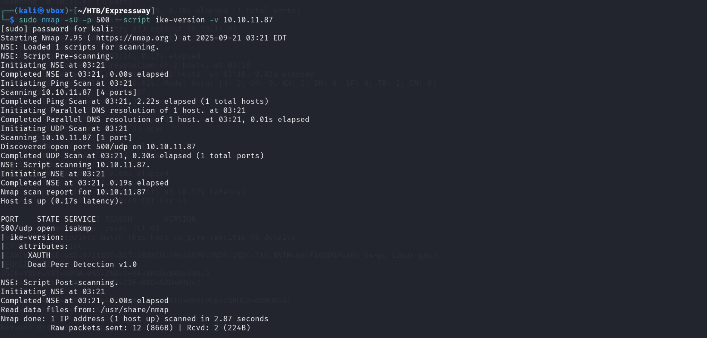
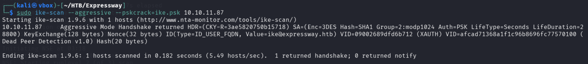
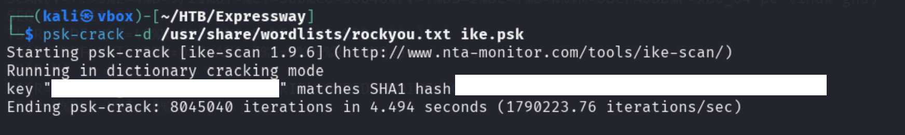
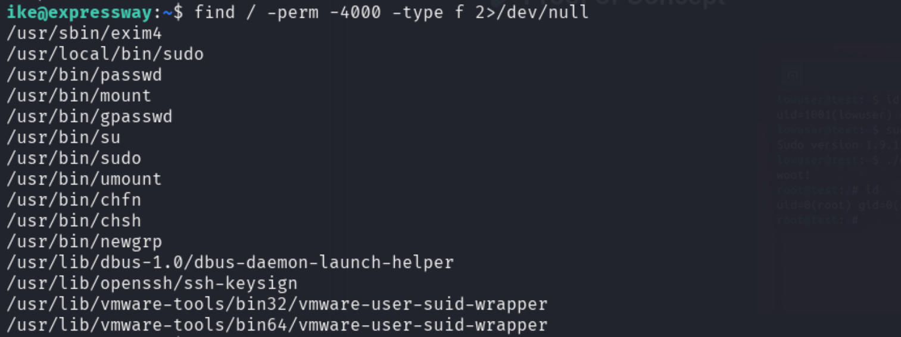

## 🛠 Overview

<table style="width:100%; table-layout:fixed;">
  <thead>
    <tr>
      <th style="width:40%; text-align:left;">Category</th>
      <th style="width:60%; text-align:left;">Info</th>
    </tr>
  </thead>
  <tbody>
    <tr><td>Machine Name</td><td>Expressway</td></tr>
    <tr><td>Difficulty</td><td>Easy</td></tr>
    <tr><td>Release Date</td><td>20 Sep 2025</td></tr>
    <tr><td>Author</td><td>dakkmaddy</td></tr>
    <tr><td>OS</td><td>Linux</td></tr>
    <tr><td>Pwned Date</td><td>21 Sep 2025</td></tr>
  </tbody>
</table>

---

## 1. Reconnaissance

Initial reconnaissance was performed using **RustScan** to quickly identify open TCP ports on the target `10.10.11.87`. RustScan results:

```bash
Open ports discovered:
- 22/tcp (SSH)
```

### Observations from RustScan
- Host responded to ICMP echo requests (TTL=63).  
- Only SSH was open over TCP.  
- File descriptor limits were noted to be low, suggesting potential speed issues in large scans.  

A follow-up **UDP scan** revealed:

```bash
500/udp open  isakmp
- XAUTH enabled
- Dead Peer Detection (DPD) v1.0
```


This indicated an active **VPN/IKE service** running on UDP port 500.

---

## 2. IKE Enumeration

Since the host had IKE/XAUTH enabled, an **IKE scan** was performed using `ike-scan`:

```bash
sudo ike-scan --aggressive --pskcrack=ike.psk 10.10.11.87
```


**Results:**
- Host returned an aggressive mode handshake:  
  - Encryption: 3DES  
  - Hash: SHA1  
  - Group: 2/modp1024  
  - Auth: PSK (XAUTH)  
  - KeyExchange: 128 bytes  
  - Nonce: 32 bytes  
  - ID: `ike@expressway.htb`  

**Analysis:**
- The PSK-based authentication allowed **offline password cracking** using `--pskcrack`.  
- The PSK file was saved as `ike.psk` and successfully cracked, allowing SSH access.


---

## 3. User Access

SSH into the user account using the cracked credentials:

```bash
ssh ike@expressway.htb
```

Once inside, enumeration was performed to **identify privilege escalation vectors**.

---

## 4. Privilege Escalation

### 4.1. SUID Binaries Enumeration

Search for SUID binaries:

```bash
find / -perm -4000 -type f 2>/dev/null
```


The `/usr/local/bin/sudo` binary was checked for version:

```bash
sudo --version
```

**Finding:**  
- Version was **vulnerable to CVE-2025-32463**.

### 4.2. CVE-2025-32463 Analysis

- **Source:** [Stratascale CRU](https://www.stratascale.com/vulnerability-alert-CVE-2025-32463-sudo-chroot)  
- **Description:**  
  > Sudo improperly loads NSS shared objects when performing chroot operations. An unprivileged user can trick Sudo into loading an arbitrary shared object, resulting in arbitrary code execution as root.  
- **Impact:** Local Privilege Escalation (root shell) possible.

### 4.3. Exploit Execution

A Proof-of-Concept exploit `sudo-chwoot.sh` was used:

- Steps performed by the script:  
  1. Creates a temporary working directory.  
  2. Compiles a **malicious shared library** that runs `/bin/bash` as root.  
  3. Configures a **fake `nsswitch.conf`** to load the malicious library.  
  4. Executes `sudo -R woot woot` to trigger the vulnerability.  
  5. Cleans up temporary files.  

**Result:**  
- A **root shell** was obtained on the target machine.

---

## 5. Conclusion

### Summary of Exploitation Path

| Step | Action | Outcome |
|------|--------|---------|
| Recon | RustScan TCP/UDP scan | Found SSH (22/tcp) and IKE (500/udp) |
| Enumeration | IKE scan + PSK crack | Obtained user `ike` credentials |
| Access | SSH login as `ike` | User shell obtained |
| Privilege Escalation | SUID enumeration | `/usr/local/bin/sudo` identified as exploitable |
| Exploitation | CVE-2025-32463 PoC | Root shell obtained |

### **Key Takeaways:**
- The combination of **IKE PSK enumeration** and **sudo NSS library vulnerability** allowed full compromise.  
- Understanding NSS shared object loading is critical for identifying this type of local privilege escalation.  
- Proper patching of Sudo and restricting user access to `/usr/local/bin/sudo` can mitigate this vector.

---

## 6. References

- RustScan: [https://github.com/RustScan/RustScan](https://github.com/RustScan/RustScan)  
- ike-scan: [http://www.nta-monitor.com/tools/ike-scan/](http://www.nta-monitor.com/tools/ike-scan/)  
- CVE-2025-32463 advisory: [Stratascale](https://www.stratascale.com/vulnerability-alert-CVE-2025-32463-sudo-chroot)

**Write-up prepared by:** *the008killer*