## let-the-penguin-live
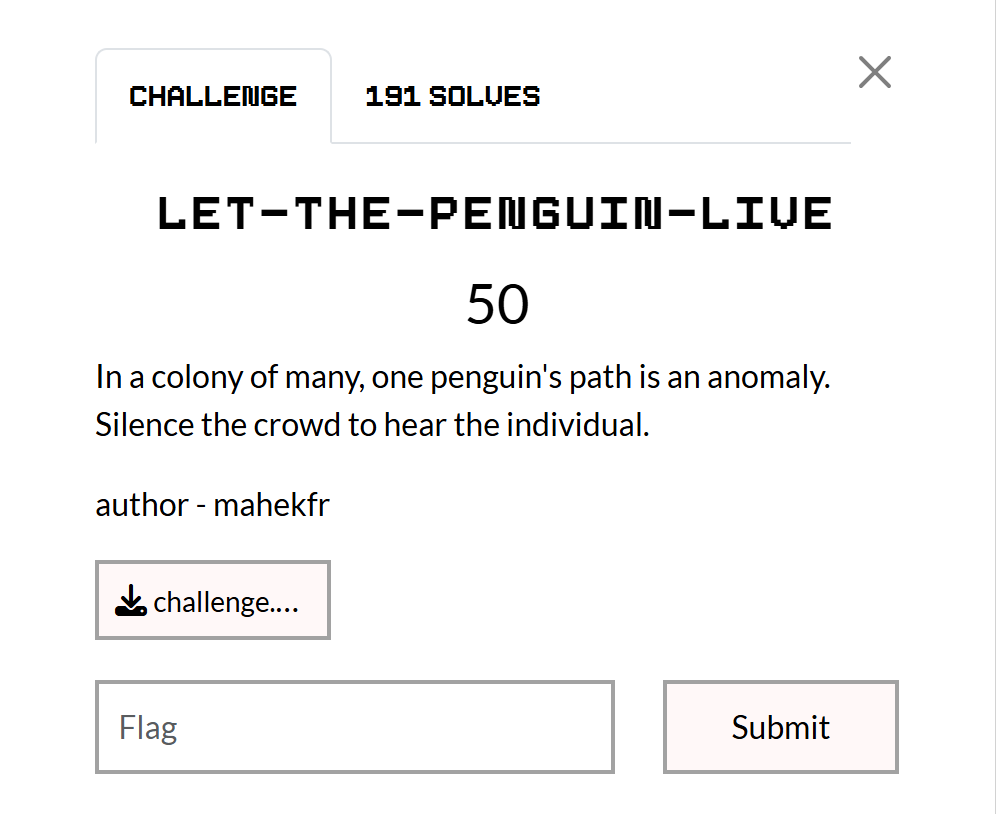

### Analysis
- Exiftool

```bash
ExifTool Version Number         : 13.36
File Name                       : challenge.mkv
Directory                       : .
File Size                       : 8.1 MB
File Modification Date/Time     : 2026:02:27 13:38:54-05:00
File Access Date/Time           : 2026:03:03 04:20:50-05:00
File Inode Change Date/Time     : 2026:02:27 14:09:14-05:00
File Permissions                : -rw-rw-r--
File Type                       : MKV
File Type Extension             : mkv
MIME Type                       : video/x-matroska
EBML Version                    : 1
EBML Read Version               : 1
Doc Type                        : matroska
Doc Type Version                : 4
Doc Type Read Version           : 2
Timecode Scale                  : 1 ms
Title                           : Penguin
                <SNIP>
Codec ID                        : A_FLAC
Track Type                      : Audio
Audio Channels                  : 2
                <SNIP>
Compatible Brands               : isomiso2avc1mp41
Comment                         : EH4X{k33p_try1ng}
                <SNIP>
```
we have a Comment ```EH4X{k33p_try1ng}``` and 2 audio channels.

- Confirming with ```ffprobe```
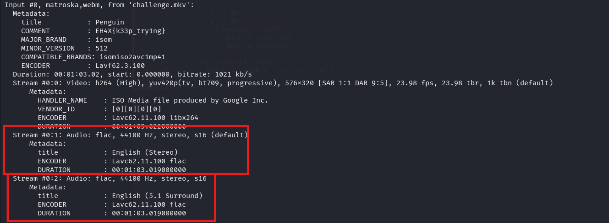

    - ``Stream #0:0``: Video
    - ``Stream #0:1``: Audio 1 default audio
    - ``Stream #0:2``: Audio 2 hidden audio

### Decoding audio 
As the description says: **_Silence the crowd to hear the individual._** we have two audios in the track ``Track = crowd + individual``. we have to remove ``crowd audio``.<br>
In sound wave if two waves are of opposite phase then phase cancellation occurs.<br>
- ``0:a:0`` -> is a Stereo -> contains Crowd noise + some audio
- ``0:a:1`` -> is 5.1 Surround -> contains Crowd noise + hidden message

So if we invert the phase of crowd noise in stereo, will cancel crowd noise in surround audio leaving the hidden message

```bash
ffmpeg -i challenge.mkv -filter_complex "[0:a:0]volume=-1[a];[0:a:1][a]amix" output.wav
```

- `[0:a:0]volume=-1[a]`: Inverts the phase of the stereo audio track
- `[0:a:1][a]amix`: Mixes the inverted stereo track with the 5.1 surround track
- Result: Identical audio (crowd noise) cancels out, leaving only the unique audio (hidden message)

### Obtain flag
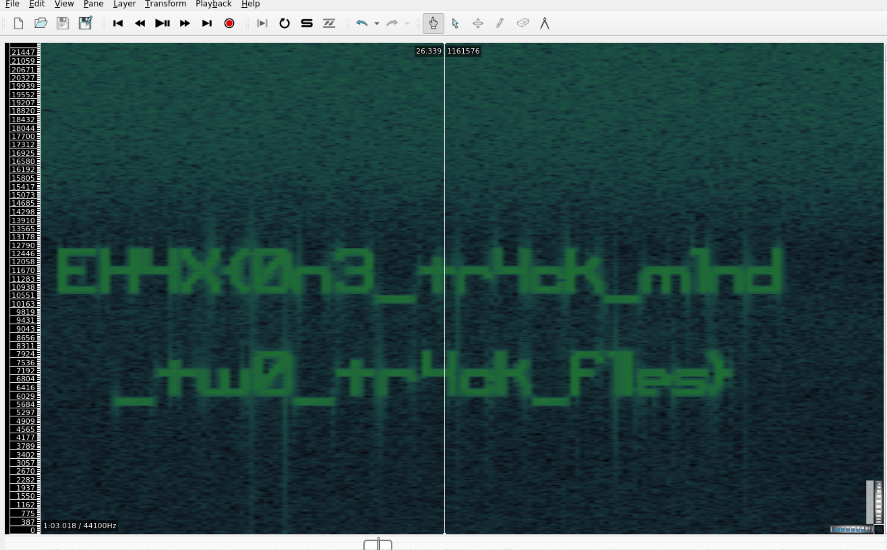

flag:

```text
EH4X{0n3_tr4ck_m1nd_tw0_tr4k_f1les}
```
<hr>

## Baby serial
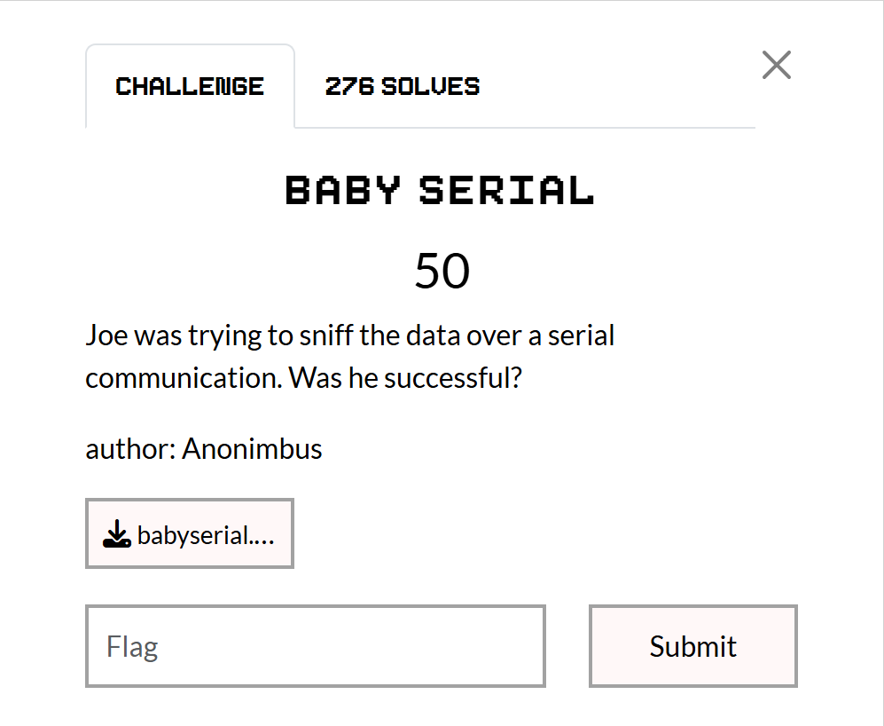

The challenge involves analyzing a Saleae logic analyzer capture (```.sal``` file) to determine if Joe successfully sniffed serial communication. First I analysed the ```sal``` file in this site: [Sal Converter](https://convert.guru/sal-converter) 
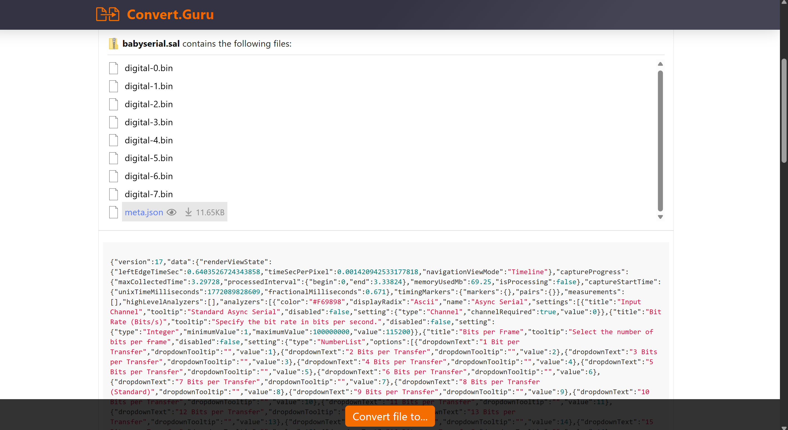

Here ```meta.json``` provides configuration details (e.g., sample rate, channel count). The ```digital.bin``` files are likely raw data chunks referenced by the ```.sal``` file.

### Using Salae Logic
Download the salae logic software first: [here](https://www.saleae.com/downloads/)

**Steps to Follow:**

- Open the ```babyserial.sal``` file in salae logic software
- We see pulses on channel 0, this is raw UART data
    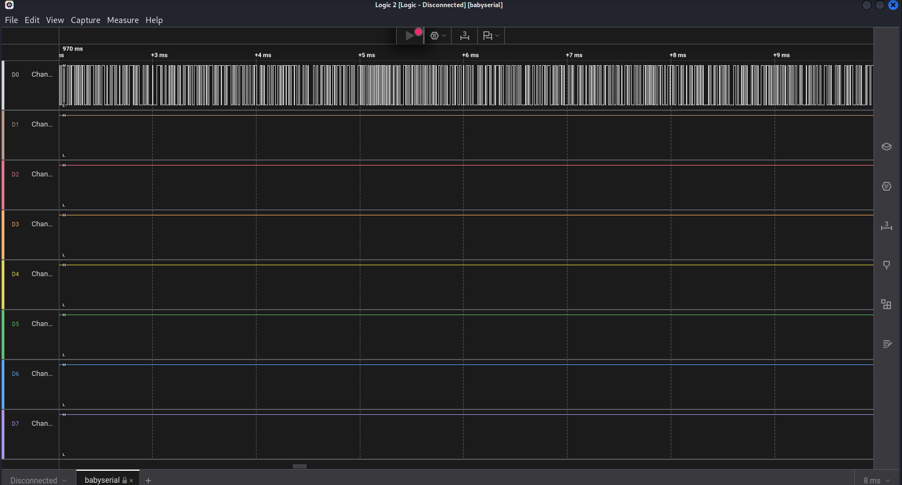
- Decode the serial data
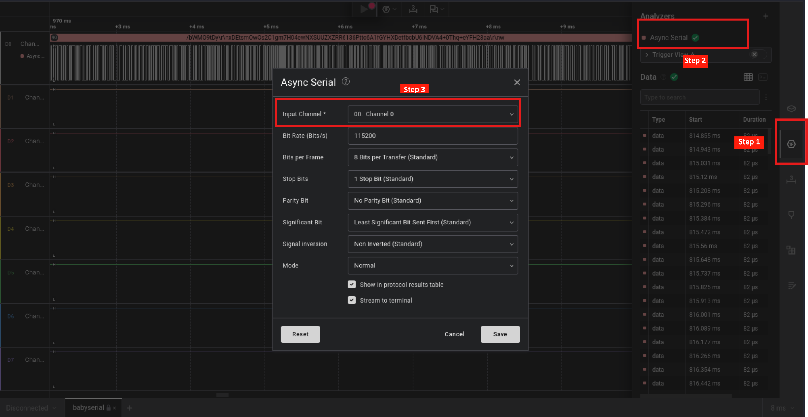
    - On right bar we see Analysers button
    - Click on Analysers and add ```Async Serial``` analyser
    - Choose channel 0 and keep other settings unchanged
- We can see ```Data``` section on right side
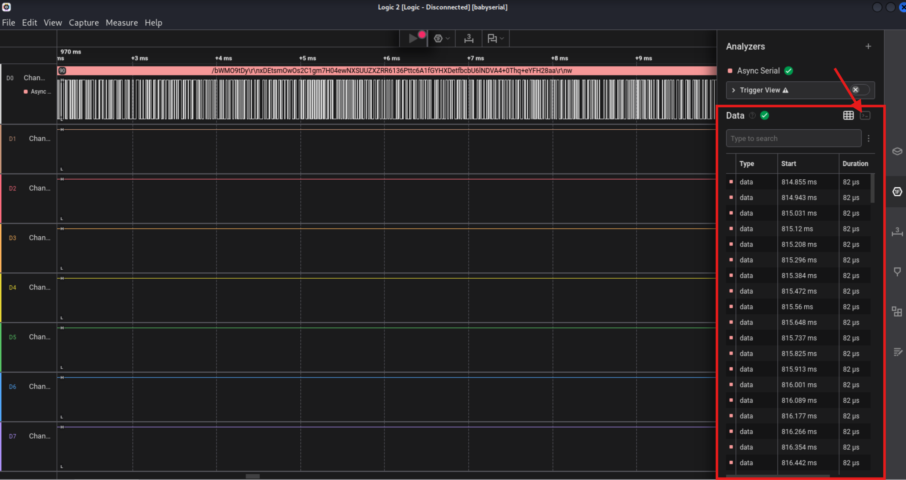
    - there is grid view and terminal view click on terminal view
    - copy the data
- Paste the data in cyberchef decode using ```From Base64``` then we see png header
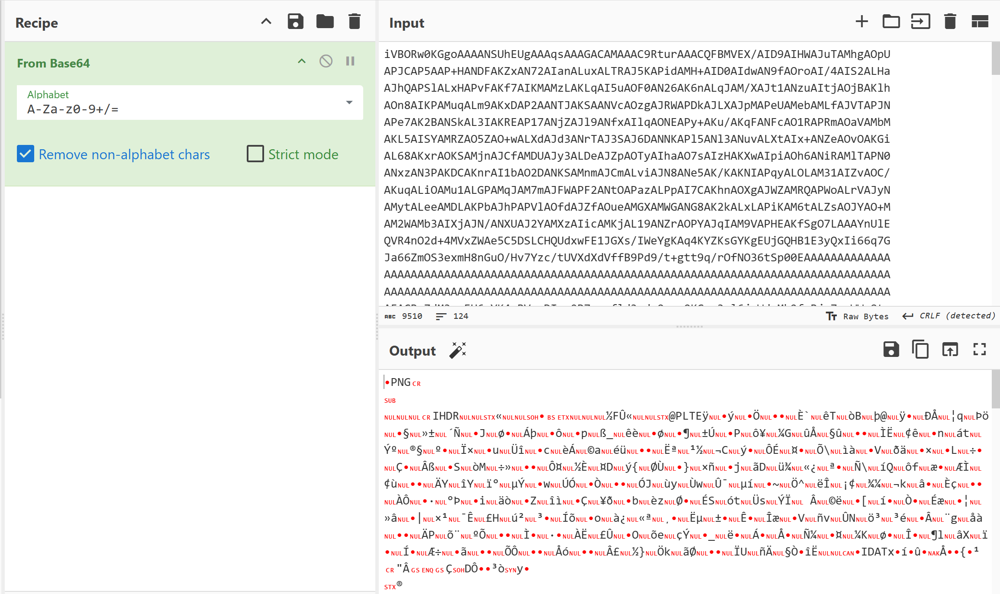
- Add render image and get flag


<hr>

## Painter
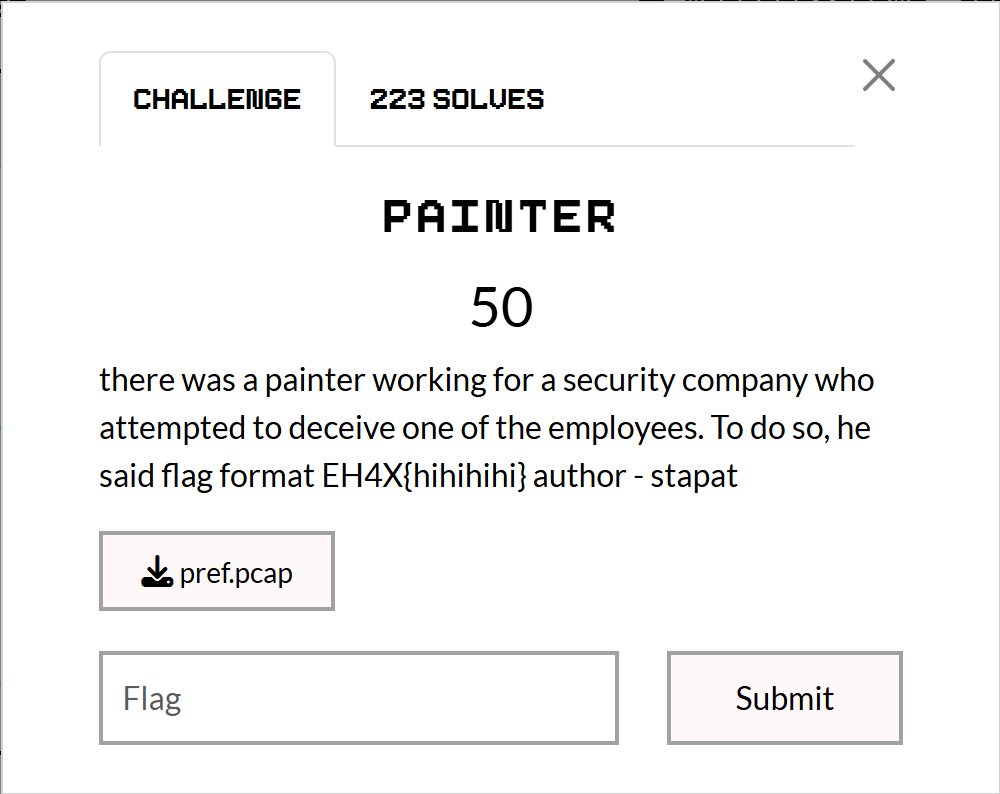

We are given a ```.pcap``` file which contained USB HID (Human Interface Device) Traffic capture data. The flag was "drawn" using a mouse or a drawing tablet.

### Analysis
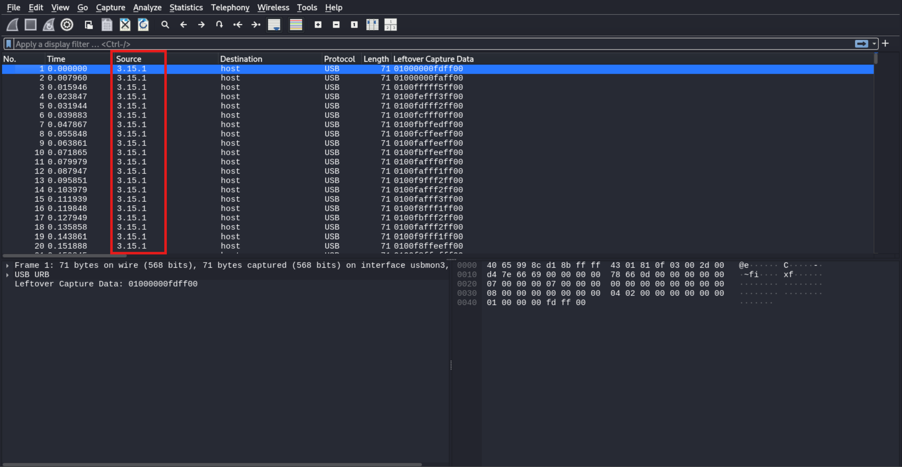
The source ```3.15.1``` tells us the traffic comes from **Bus 3, Device 15, Endpoint 1**. We need to extract the "```Leftover Capture Data```" from these specific packets.

```bash
tshark -r pref.pcap -Y "usb.device_address == 15 && usb.bus_id == 3 && usb.capdata" -T fields -e usb.capdata > data.txt
```

contents of data.txt

```bash
01000000fdff00
01000000faff00
0100fffff5ff00
0100fefff3ff00
0100fdfff2ff00
0100fcfff0ff00
0100fbffedff00
0100fcffeeff00
0100faffeeff00
0100fbffeeff00
0100fafff0ff00
0100fafff1ff00
0100f9fff2ff00
0100fafff2ff00
0100fafff3ff00
0100f8fff1ff00
0100fbfff2ff00
0100fafff2ff00
0100f9fff1ff00
0100f8ffeeff00
0100f8ffefff00
0100f8ffefff00
0100f9ffefff00
0100fafff2ff00
0100fcfff5ff00
0100fcfff7ff00
0100fefff9ff00
<SNIP>
```

### Reconstruct the drawing
Standard mouse packet is 4 bytes: ```data[0] = buttons, data[1] = x, data[2] = y```

```python
import matplotlib.pyplot as plt
import struct


x, y = 0, 0
path_x, path_y = [], []
    
with open('data.txt', 'r') as f:
    for line in f:
        data = bytes.fromhex(line.strip())
            
        if len(data) >= 6:
            button = data[0]
            dx = struct.unpack('<h', data[2:4])[0]
            dy = struct.unpack('<h', data[4:6])[0]
                
            x += dx
            y -= dy 
            if button == 0x01:
                path_x.append(x)
                path_y.append(y)

plt.figure(figsize=(12, 6))
plt.scatter(path_x, path_y, s=2, c='blue')
plt.axis('equal')
plt.show()
```
This produced following image:
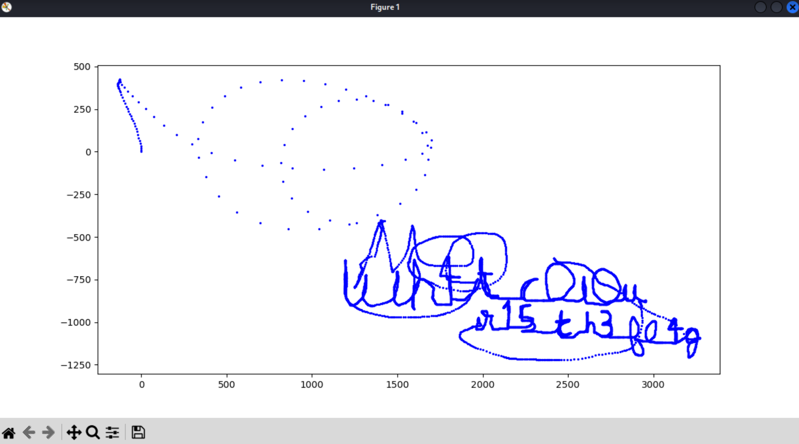

the text was:

```text
wh4t_c0l0ur_15_th3_fl4g
```
<hr>

